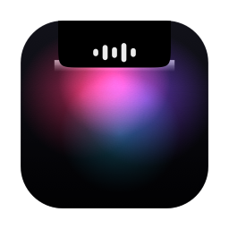
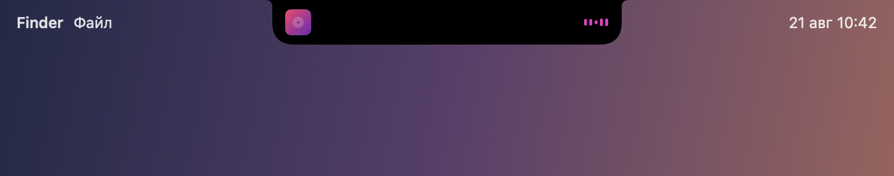
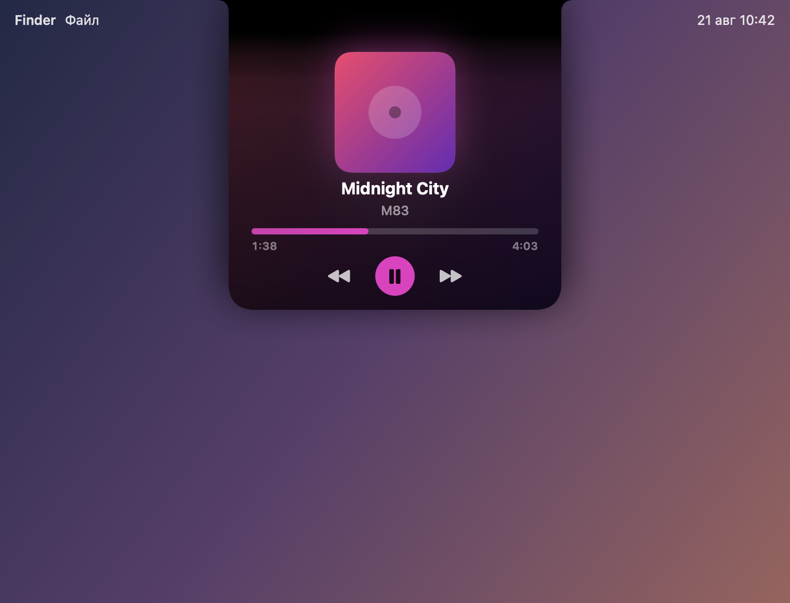
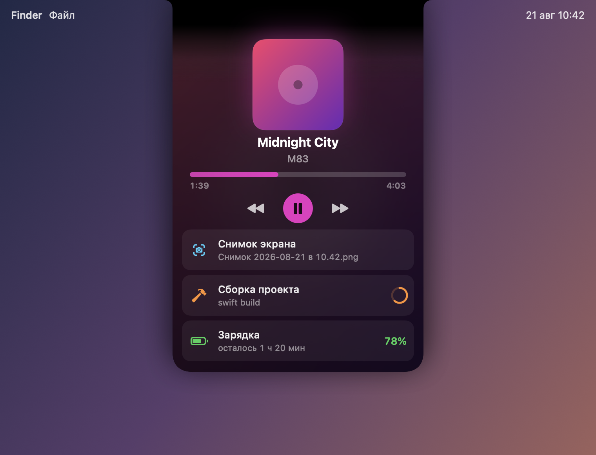
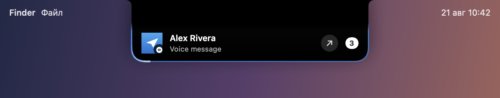

<p align="center">
  
</p>

<h1 align="center">Aura</h1>

<p align="center">
  Превращает вырез камеры MacBook в живой островок — и даёт macOS историю
  буфера обмена, которой в ней до сих пор нет.<br>
  Swift 6, SwiftUI и AppKit, без внешних зависимостей.
</p>

<p align="center">
  <b>0.4.0</b> · macOS 14.4+ · Apple silicon и Intel ·
  <a href="README.md">English</a>
</p>

<p align="center">
  
</p>

---

## Что умеет

**Остров.** В покое его не видно вовсе: он ровно по форме физического выреза.
Музыка, зарядка, снимки экрана, ближайшая встреча, смена режима фокусирования,
Wi-Fi и режим модема, загрузки браузера, уведомления других приложений.
Наводишь — раскрывается в плеер, и обложка не появляется заново на новом месте,
а вытекает из компактного слота и вырастает.

<p align="center">
  
  
</p>

**Любой источник звука — и честно.** Не только Spotify. Остров находит того,
кто действительно играет, через список аудио-процессов CoreAudio: видео во
вкладке браузера, голосовое в мессенджере. Работает это благодаря двум вещам,
которых обычно не делают. Вспомогательные процессы возводятся к родительскому
приложению — Chrome показывается как Chrome, а не как «Google Chrome Helper».
И тап на конкретный процесс отличает играющее приложение от того, которое
просто держит открытый поток вывода и молчит в него, — так ведут себя Telegram,
Discord и почти всё на Electron.

**Настоящий спектр.** Полоски эквалайзера — это честное БПФ по тапу
аудио-процессов, пять полос с потолком на каждую, а не зациклённая анимация.

**Уведомления — как на iPhone.**

<p align="center">
  
</p>

Вырез вырастает сверху вниз карточкой: значок приложения, от кого и что
пришло — текст, голосовое, кружок, фотография, файл или звонок. Обводка
в цвет самого приложения, и по ней бежит свет.

Уведомления берутся из двух источников сразу: из баннера и из базы Центра
уведомлений. Баннеров может не быть вовсе — при включённом фокусе система
их не показывает, а в настройках macOS их можно выключить у любого
приложения, — и тогда работает второй путь. Разные собеседники разводятся
по своим строкам: пять сообщений от пятерых это пять дел, а не «5»
на значке мессенджера.

Значок приложения есть всегда. У установленных он берётся по
идентификатору, у остальных — снимается с самого баннера: уведомления
с айфона приходят и от приложений, которых на Маке нет и быть не может. Дальше остаётся значок: иконка слева, число
непрочитанных справа — до тех пор, пока не откроете приложение или не уберёте
кликом. Правила по приложениям решают, кому карточка, кому только значок,
а кому ничего. Пока системный баннер ещё на экране, **ответить** можно прямо
из выреза.

**Буфер обмена.** Окно по ⌥⌘V: поиск, превью, закрепление, отмена очистки
и полный журнал всего, что когда-либо копировалось. Ссылки, картинки, файлы
и цвета распознаются и показываются как есть. Есть пипетка — взять цвет
с экрана — и галочка «вставлять с оформлением». Пароли из менеджеров в историю
не попадают: метки `org.nspasteboard.*` уважаются, а для банка или менеджера
паролей можно добавить своё исключение.

Каждая запись знает, что она такое, и предлагает действие: ссылку — открыть,
JSON — разложить по отступам, адрес — найти на карте. Скопированное на айфоне
помечается отдельно. Код подтверждения из СМС виден прямо в уведомлении,
кнопкой, — открывать переписку не нужно.

**Снимки экрана — сразу в буфере.** Снимок сохраняется на диск как обычно
и одновременно попадает в буфер: ⌘V вставит картинку, почта приложит файл.
Помнить ⌃⌘⇧4 заранее больше не нужно — решение «нужен файл или вставить»
принимается уже после снимка.

**Наушники.** Выдернули — музыка встаёт на паузу. macOS делает это сама,
но только для приложений, которые о том позаботились: Spotify так умеет,
браузер обычно нет.

**Полка.** Бросьте файлы на вырез и выберите: положить на полку, отправить
по AirDrop или сжать в архив. Позже их можно вытащить обратно прямо в письмо
или в чат.

**На экране блокировки.** Рисовать там приложениям macOS не даёт — при
блокировке скрывается вся сессия пользователя. Единственное, что система там
запускает, — заставку, поэтому Aura везёт свою: плеер, обложка и синхронный
текст песни поверх заблокированного экрана.

**Открытый API.** Любой скрипт может показать себя в вырезе:

```bash
Scripts/aura push --id build --title "Сборка" --progress 0.4
Scripts/aura remove --id build
```

---

## Установка

Всё делается одной командой, но полезно понимать, что именно происходит.

### 1. Что нужно

- macOS 14.4 или новее — раньше не было API аудио-процессов
- Xcode 15.3+ или инструменты командной строки: `xcode-select --install`
- Больше ничего: внешних зависимостей у проекта нет

### 2. Простой путь

Скачайте **Install-Aura.command** из
[последнего релиза](https://github.com/fqfqfqff/Dynamic-Island-Clipboard-MacOS/releases/latest)
и щёлкните по нему дважды — всё. Он проверит версию macOS, поставит
инструменты разработчика, если их нет, скачает исходники в `~/Developer/Aura`,
соберёт, установит и запустит Aura.

Скачанный скрипт macOS с первого раза не откроет — нажмите на нём правой
кнопкой и выберите **Открыть**, затем подтвердите. Так работает Gatekeeper.

### 2б. Или из терминала

```bash
git clone https://github.com/fqfqfqff/Dynamic-Island-Clipboard-MacOS && \
  cd Dynamic-Island-Clipboard-MacOS && ./Scripts/setup.sh
```

`setup.sh` делает пять вещей по порядку:

1. **Создаёт локальный сертификат подписи** (`Scripts/make-cert.sh`). Вот это
   важно. macOS привязывает каждое разрешение к подписи и к пути, а ad-hoc
   подпись меняется при каждой сборке — без стабильного сертификата ползунок
   в «Универсальном доступе» после пересборки становится неактивным, и всё
   приходится выдавать заново.
2. **Собирает приложение** в конфигурации release.
3. **Ставит его в `~/Applications`** — постоянный путь, по той же причине.
4. **Ставит заставку** в `~/Library/Screen Savers`.
5. **Включает автозапуск** и запускает Aura.

### 3. Первый запуск

Экран первого запуска объясняет каждое разрешение и что оно даёт. Выдать их
можно и позже — «Настройки → Система → Разрешения». Обязательных нет: без них
приложение просто умеет меньше.

### Если что-то не работает

```bash
Scripts/aura status
```

Покажет заодно расход памяти и возраст процесса. Если приложение падает
при запуске три раза подряд, оно поднимется без источников — в меню появится
пункт вернуть их обратно, чинить настройки через терминал не придётся.

Покажет, что работает, и — что полезнее — почему не работает остальное: видна
ли панель, какие источники звука видны, разрешено ли прослушивание, выдан ли
Универсальный доступ, на чём споткнулся последний опрос плеера.

### Почему нет готового бинарника

Без Developer ID за 99 долларов в год macOS считает скачанное приложение
повреждённым и открывать отказывается. Сборка из исходников обходит это
полностью и занимает меньше минуты.

---

## Разрешения

Система спрашивает их сама, при первом обращении.

| Разрешение | Зачем | Без него |
|---|---|---|
| Универсальный доступ | вставка из буфера, зеркало уведомлений, ответ | нет вставки и уведомлений |
| Автоматизация | трек, обложка и управление Музыкой и Spotify | только имя приложения, без обложки |
| Запись звука | полоски спектра и отличие играющего от молчащего | нет полосок; молчащие приложения могут показаться играющими |
| Календари | ближайшая встреча | карточки встречи не будет |
| Полный доступ к диску | состояние режима фокусирования (необязательно) | смена фокуса молчит |

Ничего не записывается и никуда не выгружается. Сетевых запросов ровно два,
оба необязательные и оба выключаются:

- **lrclib.net** — поиск текста песни, туда уходят название, исполнитель
  и длительность, и только если тексты включены;
- **open.spotify.com** — публичная страница играющего трека, чтобы прочитать
  полный список исполнителей. В AppleScript у Spotify одно поле «исполнитель»,
  и оно называет только первого. Уходит идентификатор трека, который Spotify
  и так знает, а ответ запоминается.

---

## Как этим пользоваться

| | |
|---|---|
| Навести на вырез | остров раскрывается |
| Клик по названию трека | копирует «Исполнитель — Трек» |
| Держать ⌥ над плеером | показывает альбом и источник |
| Вести по полосе времени | перемотка с превью, применяется при отпускании |
| Прокрутка вбок над вырезом | предыдущий / следующий трек |
| Долгое нажатие на вырез | быстрое меню: пауза, спрятать остров, настройки |
| Бросить файл на вырез | полка, AirDrop или архив |
| ⌥⌘V | история буфера обмена |
| ⌥⌘M | полноэкранная витрина |

Настройки открываются из значка в строке состояния. Начинаются они с уровня
**«Минимум»** — то, что меняют на самом деле, — а **«Всё»** разворачивает
тонкую подстройку: формы, размеры, кривые пружин. Весь набор сохраняется
в файл и переносится на другую машину.

---

## Разработка

```bash
./Scripts/run.sh        # собрать и запустить из ./build
./Scripts/install.sh    # пересобрать и обновить установленную копию
./Scripts/shots.sh      # снимки интерфейса в PNG — без записи экрана
./Scripts/make-icon.sh  # перерисовать обложку приложения
swift test              # 152 теста
./Scripts/bench.sh      # расход в покое: процессор и память
Scripts/aura status     # диагностика
```

Про `Scripts/shots.sh` стоит сказать отдельно: он рисует собственные виды
приложения offscreen через `NSHostingView` и складывает PNG. Разрешения на
запись экрана ему не нужно, он работает в CI — и именно им сделаны картинки
в этом файле.

---

## Устройство

```
Sources/Aura/       точка входа, только она — остальное тестируемо
Sources/AuraCore/
  App/              делегат, меню в строке состояния, внешние команды
  Notch/            геометрия выреза, окно-панель, форма, состояния
  Activities/       очередь активностей с приоритетами и все провайдеры
  Clipboard/        опрос пастборда, окно истории, журнал
  Showcase/         полноэкранная витрина и снимок для заставки
  Shelf/            файлы, брошенные на вырез
  Onboarding/       экран первого запуска с разрешениями
  Settings/         хранилище настроек, окно, профиль
  Snapshots/        offscreen-рендер видов и обложки приложения
  System/           разрешения, хоткеи, спектр звука, сторожа
Sources/AuraSaver/  плагин заставки
```

Перед тем как что-то менять, стоит прочитать [HANDOFF.md](HANDOFF.md): там
перечислено всё неочевидное, обо что проект уже спотыкался, — почему приватный
MediaRemote использовать нельзя, почему изолированное замыкание в колбэке
CoreAudio убивает процесс и как на самом деле устроен баннер уведомления
изнутри.

## Лицензия

MIT
